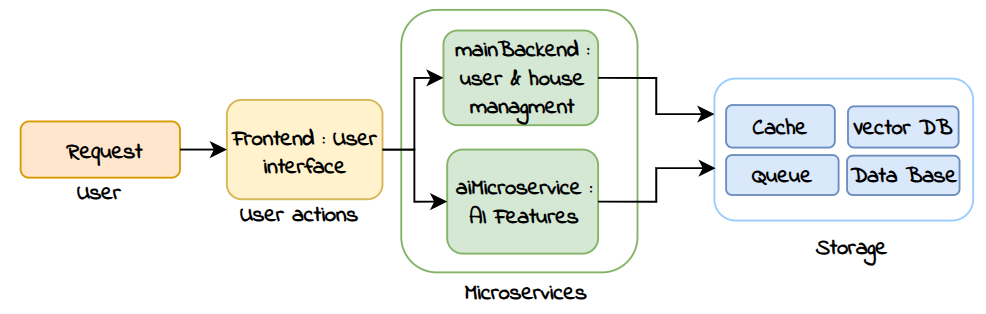
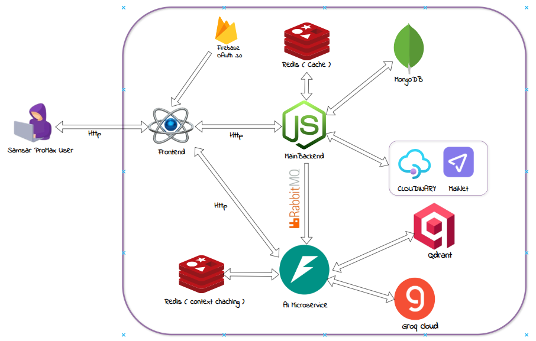
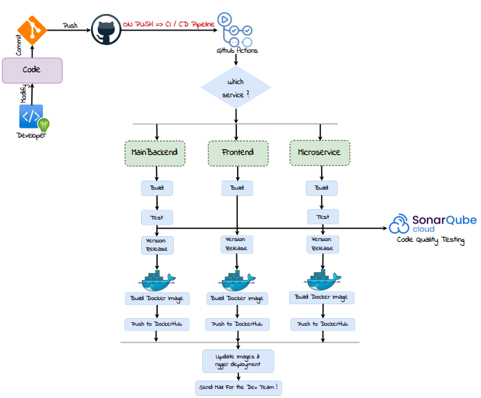

# P2M Real Estate Platform

P2M is a full-stack ai-powered real estate platform composed of:

- A React/Typescript frontend for property discovery and user actions
- A Node.js/TypeScript backend API for auth and listing management
- A FastAPI AI microservice for AI features: enhancement, validation, and prediction workflows
- Supporting infra: RabbitMQ, Redis, and Qdrant

This repository already contains separate compose files per service group. A new root [docker-compose.yml](docker-compose.yml) is included to run the complete stack with one command.

## Global Architecture



## Detailed Architecture



## AI Microservice Architecture



## DevOps & CI/CD Pipeline


---

### Service Folders

- Frontend: [frontend](frontend)
- Backend API: [backend](backend)
- AI microservice: [aimicroservice](aimicroservice)
- Root compose variants:
  - [docker-compose.yml](docker-compose.yml)
  - [backend-compose.yaml](backend-compose.yaml)
  - [frontend-compose.yaml](frontend-compose.yaml)
  - [aimicroservice-compose.yaml](aimicroservice-compose.yaml)

## Services and Ports

| Service         |  Port | Notes                  |
| --------------- | ----: | ---------------------- |
| Frontend        |  5173 | Serves built React app |
| Backend API     |  4000 | Express + TypeScript   |
| AI microservice |  8000 | FastAPI service        |
| RabbitMQ        |  5672 | Broker endpoint        |
| RabbitMQ UI     | 15672 | Management console     |
| Redis           |  6379 | Cache                  |
| Qdrant          |  6333 | Vector DB API          |

## Prerequisites

- Docker Engine 24+
- Docker Compose v2 (`docker compose`)

For local non-container development:

- Node.js 20+
- Python 3.10+

## Quick Start with Docker Compose

### 1) Configure environment files

Backend and AI services expect compose env files that already exist in this repository:

- [backend/ENV/.compose.env](backend/ENV/.compose.env)
- [aimicroservice/ENV/.compose.env](aimicroservice/ENV/.compose.env)

Update them with valid values before running in production-like mode.

Important:

- Backend needs a reachable MongoDB connection string (MongoDB is not included in compose).
- AI service keys should be set if you use cloud providers/features.

For frontend runtime env injection, set `FIREBASE_API_KEY` in your shell or root `.env` before starting compose:

```bash
export FIREBASE_API_KEY="your_firebase_key"
```

### 1) Build and start the full stack

```bash
docker compose -f docker-compose.yml up -d
```

### 2) Stop and remove containers

```bash
docker compose -f docker-compose.yml down
```

## Local Development (Without Docker)

### Backend

```bash
cd backend
npm install
npm run start
```

Backend runs on `http://localhost:4000`.

### Frontend

```bash
cd frontend
npm install
npm run dev
```

Frontend runs on `http://localhost:5173`.

### AI Microservice

```bash
cd aimicroservice
pip install -r dependencies.txt
uvicorn app.main:app --host 0.0.0.0 --port 8000 --reload
```

AI service runs on `http://localhost:8000`.

## Environment Variables

## Check the ENV/.env.exapmle for each service

## Main API Routes

### Backend

- `/api/auth/*`
- `/api/houses/*`
- `/api/cloudinary/*`

### AI Microservice

- `POST /api/enhance`
- `POST /api/house/price/sale/predict/listing`
- `POST /api/house/price/rent/predict/listing`
- `POST /api/house/validate/batch`
- `POST /api/rag/query`
- `POST /api/rag/history/clear`

## Existing Compose Variants

Use these when you only need part of the platform:

- [backend-compose.yaml](backend-compose.yaml): backend + rabbitmq + redis
- [frontend-compose.yaml](frontend-compose.yaml): frontend only
- [aimicroservice-compose.yaml](aimicroservice-compose.yaml): AI + rabbitmq + redis + qdrant
- [full-docker-compose.yaml](full-docker-compose.yaml): previously defined full stack

## Repository Notes

- The canonical compose entrypoint is now [docker-compose.yml](docker-compose.yml).
- Legacy compose files are kept for targeted workflows.
